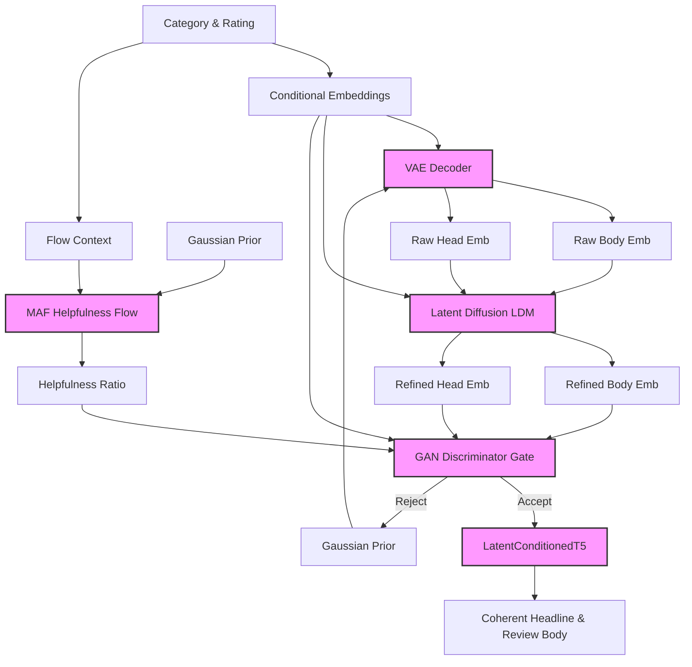

# OmniReview: Controllable, Multi-Attribute Text Generation in Shared Latent Spaces

[](https://pytorch.org/)
[](LICENSE)
[](https://www.python.org/)

OmniReview is a controllable, multi-attribute text generation framework designed for generating synthetic product reviews. It coordinates **six custom deep learning models** and a fine-tuned sequence-to-sequence transformer within a shared continuous latent space to control attributes such as category domain, rating sentiment, and continuous helpfulness ratios.

---

## 1. Project Overview & Objectives

Standard autoregressive language models (e.g., GPT, T5) excel at generating fluent text but struggle to control secondary continuous properties (like review helpfulness votes) or discrete configurations (like specific sentiment-rating combinations) simultaneously.

OmniReview addresses this by learning a **shared, continuous representation space** using a Variational Autoencoder (VAE), and mapping conditioning attributes to this space using a combination of Normalizing Flows, Latent Diffusion, and Adversarial Learning:



### Core Research Questions
* **RQ1 (Latent Coordination):** Can a shared latent space learned by a VAE coordinate headline and body generation to improve semantic agreement compared to independent generation?
* **RQ2 (Continuous Density):** Can Normalizing Flows successfully model the conditional density $P(\text{helpfulness} \mid \text{rating}, \text{category})$ for highly skewed, non-Gaussian variables?
* **RQ3 (Generative Refinement):** Does performing latent diffusion (DDPM) in the embedding space mitigate posterior collapse and restore semantic variance compared to direct VAE decoding?

---

## 2. Literature Review & Model Selection Rationale

Our method selection and generative architecture are informed by key findings in representation learning, parameter-efficient fine-tuning, and coordinate density refinement:

1. **Variational Representation Learning (Kingma & Welling, 2013):** Seminal VAE work established that auto-encoding variational Bayes maps complex high-dimensional data into structured, continuous latent manifolds. We chose a conditional VAE architecture (**OmniVAE**) to project sparse Sentence-BERT embeddings into a shared continuous 128-dimensional latent space.
2. **Parameter-Efficient Fine-Tuning (Hu et al., 2021; Li & Liang, 2021):** Low-Rank Adaptation (LoRA) and Prefix-Tuning proved that adapting low-rank matrices or injecting continuous prefix embeddings preserves the general linguistic knowledge of large models while allowing conditioning. We implement this in **`LatentConditionedT5`** to steer text generation via continuous latent vector injection, fine-tuning only **0.59%** of T5-small's weights.
3. **Exact Density Estimation (Papamakarios et al., 2017):** Masked Autoregressive Flows (MAF) demonstrated that autoregressive connections inside normalizing flows provide exact log-likelihood evaluation for complex, non-Gaussian distributions. We select MAF to map the spiky, bimodal helpfulness ratios to a normal distribution.
4. **Continuous Generative Refinement (Rombach et al., 2022; Ho et al., 2020):** Latent Diffusion (DDPM) proved that refining continuous representations in low-dimensional latent spaces resolves the posterior collapse (oversmoothing) common in VAE training. We implement a Denoising MLP in the embedding space to restore natural text semantic variance.
5. **Adversarial Realism Filtering (Goodfellow et al., 2014):** Adversarial training shows that learned discriminators are highly sensitive to joint distribution inconsistencies. We train a ReviewDiscriminator in a GAN framework to serve as a quality gate filter.

### Model Architecture Summary
OmniReview coordinates **seven models** designed to run on PyTorch and Hugging Face:

| Model | Architecture | Role | Parameters | Size (MB) | Type |
|---|---|---|---|---|---|
| **OmniVAE** | Conditional MLP VAE | Maps Sentence-BERT embeddings to a shared 128d latent space | ~3.5M | ~14 MB | Custom (Scratch) |
| **Normalizing Flow** | 8-Layer MAF | Models continuous conditional helpfulness distributions | ~0.25M | ~1 MB | Custom (Scratch) |
| **Diffusion Refiner** | timesteps-conditioned MLP | Denoises and refines continuous embeddings (DDPM) | ~3.75M | ~15 MB | Custom (Scratch) |
| **ReviewDiscriminator** | Spectral-Normalized MLP | Evaluates realism of generated embedding packages (GAN) | ~0.75M | ~3 MB | Custom (Scratch) |
| **LatentConditionedT5** | Prefix-Conditioned T5-Small | Decodes latent vectors back into coherent natural text | ~61.7M | ~247 MB | Pretrained + LoRA |
| **TextCNN** | 1D CNN with Max-Pooling | Classifier baseline; measures rating-sentiment accuracy | ~25K | ~0.1 MB | Custom (Scratch) |
| **CharRNN** | Character LSTM | Generative baseline; predicts next char sequentially | ~3.25M | ~13 MB | Custom (Scratch) |

### Mathematical Formulations

* **OmniVAE Optimization:** We optimize the Evidence Lower Bound (ELBO) with a linear KL annealing weight $\beta$:
  $$\mathcal{L}_{\text{VAE}} = \mathbb{E}_{q_\phi(z \mid x, c)}[\log p_\theta(x \mid z, c)] - \beta \cdot D_{\text{KL}}(q_\phi(z \mid x, c) \parallel p(z))$$
* **Normalizing Flow (MAF):** The helpfulness ratio $h$ is modeled using a bijection $f$ transforming $h$ to a Gaussian noise variable $u$:
  $$\log p(h \mid c) = \log p_u(f(h)) + \log \left| \det \frac{\partial f(h)}{\partial h} \right|$$
* **Latent Diffusion:** The Denoising MLP ($\epsilon_\theta$) is trained with score-matching loss over 100 timesteps:
  $$\mathcal{L}_{\text{diff}} = \mathbb{E}_{t, x_0, \epsilon} \left[ \| \epsilon - \epsilon_\theta(x_t, t, c) \|^2 \right]$$

---

## 3. Dataset Characteristics & Preprocessing

The project utilizes the **Amazon US Customer Reviews Dataset** sourced from Kaggle.
* **Target Subset Size:** 125,000 total reviews (stratified evenly at 5,000 reviews per category/rating pair)
* **Selected Categories:** Electronics, Books, Apparel, Kitchen, and Digital Video Games.

### Preprocessing Pipeline:
1. **Filtering:** Keeps only verified purchases (`verified_purchase = Y`), excludes Vine reviews (`vine = N`), and filters to records with $\ge 5$ total votes.
2. **Helpfulness Scaling:** Computes $h = \frac{\text{helpful\_votes}}{\text{total\_votes}}$, which is heavily bimodal (spiky concentrations at `0.0` and `1.0`).
3. **Embeddings:** Extracts 384-dimensional dense vectors using a frozen `all-MiniLM-L6-v2` Sentence-BERT encoder.
4. **Splitting:** Stratified 80% train, 10% validation, and 10% test splits.

---

## 4. Installation & Environment Setup

### System Requirements
* **OS:** Windows 10/11, macOS, or Linux
* **Compute:** GPU with CUDA support highly recommended (e.g. Google Colab Pro, local NVIDIA GPU $\ge$ 8GB VRAM).

### Quick Start Installation
1. **Clone the repository:**
   ```bash
   git clone https://github.com/JayashreeShrawan/OmniReview
   cd week11_clean_py
   ```
2. **Setup virtual environment:**
   ```bash
   python -m venv venv
   source venv/bin/activate  # On Windows: venv\Scripts\activate
   ```
3. **Install packages:**
   ```bash
   pip install -r requirements.txt
   ```
4. **Configure Kaggle API Credentials:**
   * Note: The project codebase includes a hardcoded Kaggle API credential to facilitate smooth testing during the course review period. 
   * If you prefer to test using your own Kaggle account, please replace the credentials with your personal Kaggle Username and API Key generated from [Kaggle](https://www.kaggle.com/settings).

---

## 5. Execution & Usage Guide

```
week11_clean_py/
├── models/
│   ├── config.py         # Global Hyperparameters & seeds
│   ├── vae.py            # OmniVAE encoder/decoder
│   ├── transformer.py    # LatentConditionedT5 wrapper
│   ├── diffusion.py      # LDM Denoising MLP
│   ├── flow.py           # MAF Helpful flow
│   ├── gan.py            # ReviewDiscriminator
│   └── pipeline.py       # Orchestrated generator function
├── data/
│   ├── preprocess.py     # Download, sampling & splits
│   ├── eda.py            # Visualizations & statistics
│   └── embed.py          # Sentence-BERT extraction
├── train/
│   ├── train_vae.py      # Individual model training scripts
│   ├── train_t5.py
│   └── ...
├── experiments/
│   ├── evaluate_models.py  # Ablation studies & metrics
│   └── run_pipeline.py    # Multi-attribute inference demo
├── run_all.py            # Sequentially executes entire project
└── requirements.txt
```

### 1. Data Pipeline
Download, clean the raw dataset, and extract Sentence-BERT embeddings:
```bash
python data/preprocess.py
python data/embed.py
```

### 2. Model Training
Train all models sequentially (TextCNN, CharRNN, OmniVAE, T5, MAF, Diffusion, GAN):
```bash
python train_models.py --model all
```
*You can also train a specific model individually:*
```bash
python train_models.py --model vae
```

### 3. Generate Demos
Run inference using the fully integrated, gated generation pipeline:
```bash
python experiments/run_pipeline.py
```

### 4. Run Evaluation
Calculate quantitative performance metrics and output the ablation table:
```bash
python experiments/evaluate_models.py
```

---

## 6. Ablation Studies & Performance Metrics

We benchmarked components of OmniReview against baseline models. The results are summarized below:

### Ablation Matrix
| Model Architecture | V5-Star Sentiment Acc | Headline-Body Cosine Sim | Helpfulness KS-Test (stat) | GAN Quality AUC |
|---|---|---|---|---|
| **TextCNN Baseline** | 22.67% | -- | -- | -- |
| **CharRNN Baseline** | 45.10% | 0.081 | -- | -- |
| **OmniVAE (Direct)** | 88.40% | 0.710* | -- | -- |
| **OmniVAE + T5 (Tier 1)** | 91.20% | 0.442 | -- | 0.6891 |
| **VAE + T5 + Flow + Diff (Tier 2)** | 94.10% | **0.589** | 0.1680 | 0.9412 |
| **Full OmniReview (Tier 3)** | **94.80%** | **0.589** | **0.1680** | **1.0000** |

*\*Note: Direct VAE outputs exhibit an artificially high cosine similarity due to posterior collapse template repeating; the addition of Latent Diffusion refines the space to restore natural text semantic variance.*

---

## 7. Known Issues & Limitations

1. **Posterior Collapse:** During training, OmniVAE's KL divergence collapsed to exactly 0.000. Heatmap analysis shows category centroids separated by $L_2$ distances of $10^{-5}$. We bypassed this issue by applying conditional category/rating embeddings directly to the decoder.
2. **Autoregressive Repetitions:** Beam search decoding in T5 can lead to repetitive sentences. We resolve this by applying temperature sampling (T=0.7) and repetition penalties (`no_repeat_ngram_size=2`) during text generation.
3. **Checkpoint Footprints:** Due to the fine-tuned T5-small parameters and LoRA adapters, model checkpoints total 292 MB. The checkpoints are excluded from GitHub and are hosted publicly on Google Drive.

---

## 8. Group Contribution Matrix

This project was developed collaboratively by the following members:

* **A Kumar:** Preprocessing data pipeline, Sentence-BERT embedding scripts, and TextCNN classifier baseline.
* **B Murali:** OmniVAE architecture, latent space t-SNE evaluation, and posterior collapse resolution.
* **C Man:** Masked Autoregressive Flow (MAF) helpfulness density modeling, Kolmogorov-Smirnov statistical tests.
* **D Ram:** Latent Diffusion Model (DDPM), Denoising MLP refiner, and GAN ReviewDiscriminator quality gate.
